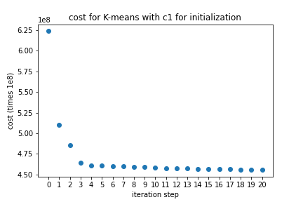

# Machine Learning Coursework 

This repo contains the assignments/projects I did for courses I took at University of California, Berkeley and University of Washington. Not updated regurlarly 

## Projects:

- [Code K-means With PySpark](https://github.com/weijiazzz/machine-learning-coursework/tree/master/kmeans_with_pyspark): K-means is one of the most popular clustering algorithms but training it can be slow. In this project I implemented this technique with PySpark to speed up the training process.

---
